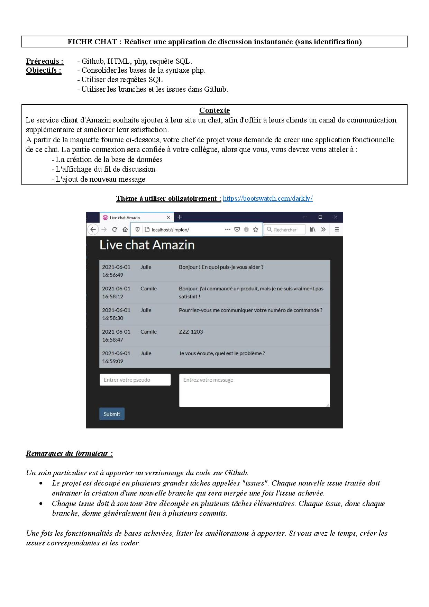

# Table of Contents 
- [Project-Specification](#Project-Specification) 
- [Pre-requisites](#Pre-requisites) 
- [How-to-use-it](#How-to-use-it) 
- [Some-Screenshots](#Some-Screenshots) 

# Project-Specification


# Pre-requisites
- HTML5, PHP7 and SQL
- Create a new SQL Database using your PHPMyAdmin

# How-to-use-it
- From root repo, lanch your PHP server:<br>
```shell
php -S localhost:8000
```
- and using your browser goto: localhost:8000
- Or clone this repo in "www" repo of your WampServer and go to this path using your localhost path

# Some-Screenshots
- Chat interface: 
  * You need to specify pseudo and message  
  * Only last 10 messages will be prompt
  * You have possibility to remove message you have posted by clicking on the red cross on the right  
  
- In case you dont specify the pseudo or the message warnings will be prompt
  * Both:    

  * Only message is missing:    

  * Only pseudo is missing:  


